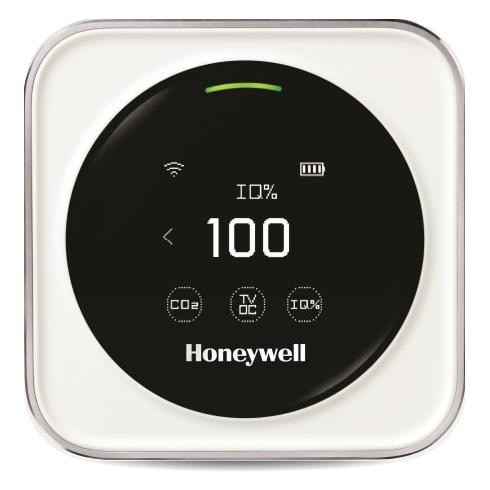

# Honeywell Indoor Air Quality Detector to MQTT

Simple application to read the air quality from the Honeywell Indoor Air Quality Detector Cloud and publish the data to an MQTT broker.



## Installation

Application distributed as simple docker image, supported architectures are:

- amd64 (Intel, AMD)
- arm64 (Mac Silicon, ...)
- armhf (Raspberry Pi, ...)

Sample docker compose file for reference:

```yaml
version: "3.9"
services:
  honeywell_iaq:
    container_name: "honeywell_iaq"
    command: "mqtt" # or "log"
    restart: always
    image: "ghcr.io/heapy/honeywell-iaq:main"
    environment:
      - MQTT_URL=tcp://192.168.1.1:1883
      - MQTT_CLIENT_ID=honeywell-iaq-mqtt
      - PHONE_NUMBER=+8615151860095
      - PASSWORD=hhjwq15151860095
      - PHONE_UUID=generate-some-using- https://duckduckgo.com/?q=uuid
```

## Why it's not ideal solutions

This solution relies on unstable Honeywell chinese cloud servers. Sometimes they are may not be available or like it's happen to me, TLS certificate was expired for few days.

**Better solution would be to develop firmware that connects directly to MQTT Broker from device.**
